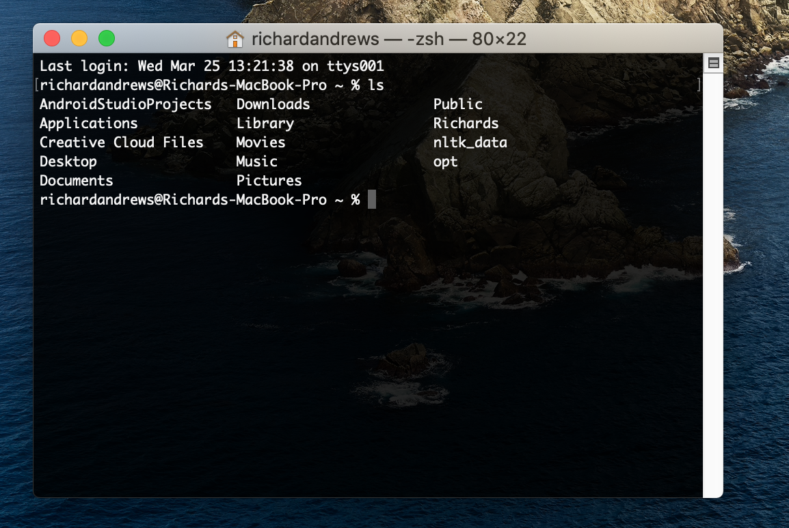
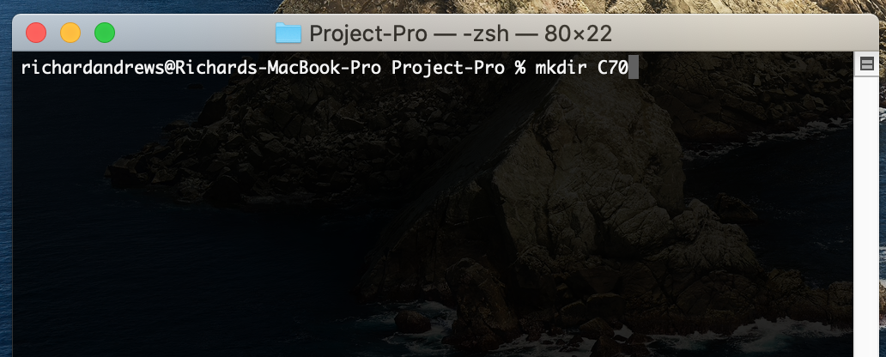
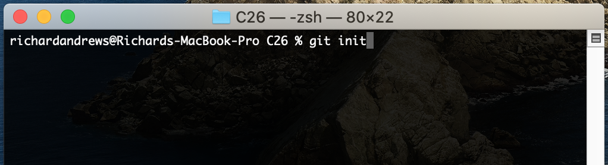
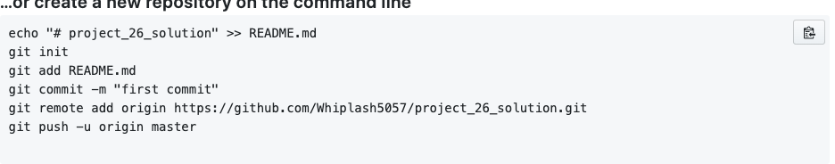

# USE COMMAND LINE/TERMINAL FOR GITHUB
#### Title: "Upload files to GITHUB using terminal/command line interface"
#### Description: "GITHUB allows you to upload files to the cloud. Your friends can take a look at what you've made."
---

## Find out your projects current working directory and create a folder:

- Open the terminal/command line interface on your computer.
- To enter a folder type "cd folder_name" and press enter.
- To find out all the files in a folder type "ls" and perss enter.
- Create a folder type "mkdir folder_name".
- Download all the files from the  <a href="https://editor.p5js.org/shgupta23/sketches/CwI2YyY2j">link</a> into the folder you created.

 
 
 
 
 ## Initialize git for your project

- Type "git init" and press enter. 
- Complete all the questions properly.

 
 
 
 
 ## Create a github repository:

-  You have alread learnt to create a repository in Class 19. 
-  Use the same approach to create a repository.
- Follow all the instructions on the github image.

 
 
 
 
## You did it: Congratulations! Your product is out in the market.

